# 2LM-Blackwell-GAL &mdash; 学習データを自分で作り、キャラクターを与える (Windows + RTX 50)

前作 [2LM-Blackwell](https://github.com/hiroki-abe-58/2LM-Blackwell) は「ぎりぎり話が通じる」
13.81M のミニ言語モデルでした。このリポジトリではそこに**キャラクター**を与えます。
一人称が「うち」で、敬語を使わない口調です。

**その学習データは公開データセットにありません。ローカルの 32B モデルに書かせて自分で作ります。**
そして今回の主題は、Mac 版で未測定だった「**日本語が崩れなくなる境界はどこか**」の実測です。

- データ生成: Qwen2.5-32B-Instruct-AWQ をローカルで動かし、**36.7 分で 6,879 会話**
- 追加学習: 事前学習済みの重みから **7.0 秒**（307ステップ / VRAM ピーク 1.88 GB）
- 結果: ギャル度 **0.74** / 一人称「うち」0.63 / 敬語 **0.00** / 打ち切り 0.00 / 繰り返し 0.00
- 境界: 崩れる境界は会話数の1点ではなく、**会話数 × 学習率が作る面**だった
- 代償: 公開データに対する bits/char は 2.586 → 6.247 に悪化し、主題保持率は **0.000** になる

Apple Silicon / MLX 版 [2LM-MLX-GAL](https://github.com/hiroki-abe-58/2LM-MLX-GAL) の移植です。
移植元は「855件では崩れ、2,610件では崩れなかった」で止まっていました。
本リポジトリはそこを 20 条件の総当たり + 学習率スイープで測り直し、**説明を書き換えています**。

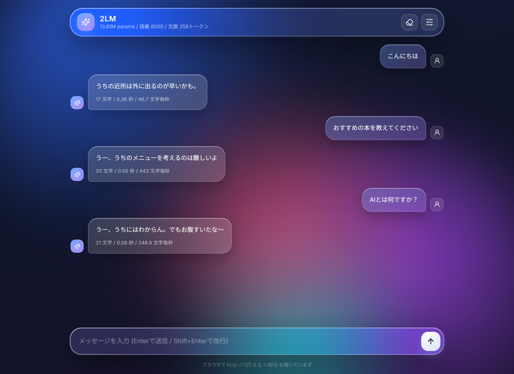

## 前作から何が変わったか

| | 2LM-Blackwell | 2LM-Blackwell-GAL |
|---|---|---|
| データ | 公開データセット 4種 / 948万文字 | **自分で生成した 6,879 会話 / 26万文字** |
| 学習 | 事前学習 3,600ステップ / 78.5 秒 | **追加学習 307ステップ / 7.0 秒** |
| モデル構造 | ミニGPT 13.81M | 完全に同じ（重みを引き継ぐ） |
| 評価 | 4指標（bits/char / 主題保持 / 反復 / 破綻） | **口調4指標 + 崩れ3指標を追加** |
| 主題 | トークナイザとデータ量 | **崩れる境界の実測** |

モデル構造は3部作を通して1つも変えていません。**変えたのはデータだけ**です。

## できること

| やること | コマンド |
|---|---|
| 環境診断（最初にこれ） | `python check_env.py` |
| ライセンス点検（データを作る前に） | `python tools\license_check.py --save runs\licensing.json` |
| KV キャッシュの必要量を計算（DL 前に） | `python tools\model_survey.py` |
| バックエンドのはしごを検証 | `python tools\backend_ladder.py --rung awq` |
| バッチサイズを決める | `python data\gal\generate.py --stage calibrate` |
| データ生成（3段） | `--stage topics` → `--stage pairs` → `--stage build` |
| 追加学習 | `python src\train.py --init-from checkpoints\final ...` |
| 口調と崩れを採点 | `python tools\reply_metrics.py --ckpt checkpoints\gal` |
| 境界の総当たり | `python tools\boundary_sweep.py --counts 1000 2000 --mixes 85 100` |
| 前後の比較 | `python tools\compare_style.py` |
| CLI チャット | `python src\chat_cli.py --ckpt checkpoints\gal` |
| Web GUI | `python server.py --ckpt checkpoints\gal --open` |

**クローンした時点で `checkpoints/gal/` と `data/raw/gal_line.jsonl` が入っています。**
データ生成（36.7 分）と学習（7 秒）を飛ばして、いきなり会話から始められます。

## セットアップ

必要なもの: Windows 10/11 / NVIDIA GPU / [uv](https://docs.astral.sh/uv/)。
前作と同じ仮想環境が使えます（データ生成をする場合だけ `transformers` などが増えます）。

```powershell
# 1. 環境変数（ユーザースコープ。設定後にターミナルを開き直す）
setx PYTHONUTF8 1
setx PYTHONIOENCODING utf-8
setx HF_HOME E:\hf_cache             # 18GB のモデルを落とすので空きの大きいドライブへ
setx TORCHINDUCTOR_CACHE_DIR E:\ti_cache
setx CUDA_MODULE_LOADING LAZY

# 2. 仮想環境（3リポジトリで共用する想定）
uv venv C:\LLM\.venv-blackwell --python 3.13
C:\LLM\.venv-blackwell\Scripts\Activate.ps1

# 3. 依存（torch は PyPI ではなく NVIDIA のインデックスから）
uv pip install -r requirements.txt --extra-index-url https://download.pytorch.org/whl/cu130

# 4. 診断
python check_env.py

# 5. 会話する（同梱の重みを使うので学習は不要）
python src\chat_cli.py --ckpt checkpoints\gal
```

会話と学習だけなら `torch` / `sentencepiece` / `safetensors` / `numpy` で足ります。
`transformers` / `autoawq` / `accelerate` / `bitsandbytes` はデータ生成にだけ必要で、
`requirements.txt` の後半にその旨をコメントで書いてあります
（`transformers` は 4 系に固定。5 系は AWQ の読み込みに gptqmodel を要求し、
その依存の `pypcre` が Windows でビルドできません）。

## 1. 着手前に、ライセンスを機械的に調べる

```powershell
python tools\license_check.py --save runs\licensing.json
```

「生成AIの出力を学習に使ってよいか」はモデルごとに違い、**作ってから気づいても引き返せません**。
18GB のモデルを落とし、40 分かけてデータを作り、学習まで通してから禁止条項を見つけると、全部捨てます。

Hugging Face からライセンス本文を取得し、`output` / `distill` / `improve` / `derivative` を
含む行を抜き出して表示します。**使えると判断したのは Apache-2.0 か MIT だけ**です。

| モデル | ライセンス | 判定 |
|---|---|---|
| **Qwen/Qwen2.5-32B-Instruct-AWQ** | Apache-2.0 | **採用**（出力の利用に条件なし） |
| tokyotech-llm/Qwen3-Swallow-8B-RL-v0.2 | Apache-2.0 | 可（はしごの検証に使用） |
| meta-llama/Llama-3.3-70B-Instruct | Llama Community | **不可**。出力を他モデルの改善に使うことを明文で禁止 |
| google/gemma-3-27b-it | Gemma Terms | **不可**。Model Derivatives の定義に蒸留を含む |
| 商用チャットAPI | 各利用規約 | **不可**。出力の学習利用を禁止 |

「小規模な個人利用なら」という例外はどこにも書かれていません。
**規模で許されるという解釈は、条文には根拠がありません。**

公開されている合成データセットを混ぜる場合は、データセット自身のライセンスだけでなく
**それを生成したモデルのライセンスまで遡る**必要があります。生成元が不明なものは外しました。

## 2. 32B を落とす前に、8B で通り道を確かめる

```powershell
python tools\model_survey.py                     # config.json だけ見て KV を計算
python tools\backend_ladder.py --rung awq        # 1段目: transformers + AWQ
python tools\backend_ladder.py --rung gguf       # 2段目: llama-cpp-python + GGUF
python tools\backend_ladder.py --rung nf4        # 3段目: bitsandbytes NF4
```

Mac 版では 17GB のモデルを2回落としました。載るかを確かめずに落としたためです。
今回は**重みをダウンロードする前に** `runtime.kv_report()` で KV キャッシュを計算します。

| モデル | KV / トークン | 重み（bf16） |
|---|---|---|
| Qwen3-Swallow-8B | **144 KB** | 15.3 GB |
| Qwen3-Swallow-30B-A3B | **96 KB** | 56.9 GB |

**8B のほうが 30B より KV が大きい。** GQA のグループ数と層数で決まるので、
パラメータ数に比例しません。バッチサイズを決めるのは重みではなく KV です。
ここを見ないと「小さいモデルなのにバッチが上げられない」ことが起きます。

### はしごの結果（`runs/backend_ladder.json`）

| 段 | 構成 | 結果 |
|---|---|---|
| 1 | transformers + AWQ / 8B（`tokyotech-llm/...-AWQ-INT4`） | **読めるのに壊れている**（後述）。ここで一番時間を使った |
| 1 | transformers + AWQ / 8B（`Qwen/Qwen3-8B-AWQ`） | 通った。バッチ 2 で 19.5 tok/s |
| 1 | transformers + AWQ / **32B**（`Qwen/Qwen2.5-32B-Instruct-AWQ`） | **通った**。バッチ 8 で 43.2 / 24 で 124.3 / **64 で 270.3 tok/s** |
| 2 | llama-cpp-python + GGUF Q4_K_M / 8B | 通った。**194.2 tok/s**（バッチAPIが無いので逐次） |
| 3 | bitsandbytes NF4 | 1段目が通ったので未実施 |

同じ 8B でも、AWQ を作った道具が違えば結果が違います。**「AWQ かどうか」ではなく
「誰が量子化したか」を見る**必要があります。

`Llama` クラスにはバッチ生成がありません。1本ずつしか流せないので、
**まとめて大量に作るなら AWQ + 大きいバッチ、1本ずつ速く返すなら GGUF** です。
データ生成は前者なので 32B AWQ を選びました。
なお GGUF は Blackwell 対応の wheel が無く、CUDA ありで自前ビルドしました（25 分）。

### AWQ には「読めるのに壊れている」ものがある

いちばん時間を取られた罠です。読み込みは成功するのに、生成が
`CUDA error: device-side assert triggered` で落ちます。

```powershell
python tools\nan_hunt.py     # 全モジュールにフックを付けて NaN の初出層を探す
```

**逆量子化した重みの絶対値が最大 5,220 になっていました。** LLM の重みが 5,000 を
超えることはないので、逆量子化そのものが間違っています。
`config.json` の `quantization_config` に `desc_act: true` があり、
`meta.quantizer` が `gptqmodel` でした。入力チャネルを並べ替えてから量子化する方式で、
AutoAWQ はその並べ替え表（`g_idx`）を持ちません。
**エラーを出さずに読み込み、間違った重みを作ります。**

しかも落ちる場所が原因から3層離れています。最大値 5,220 が `mlp.up_proj` で
fp16 の上限 65,504 を超えて Inf になり、次の層で NaN、最後にサンプリングの assert で落ちる。

対策は `backends.check_awq_checkpoint()` で、**読み込む前に `config.json` を見て弾く**ことです。
「動くけれど結果が壊れている」がいちばん怖い止まり方なので、先に落とす仕掛けが要ります。

## 3. バッチサイズは「動いた」ではなく「こぼれなかった」で決める

```powershell
python data\gal\generate.py --stage calibrate
```

Windows は VRAM を使い切っても例外を出さず、システムRAM へ退避して 10 倍前後遅くなります。
「動いた」を基準にすると、**気づかないまま13時間かかる設定**を選びます。

```
  バッチ       秒     件/分     VRAM       共有  判定
      8     24.2     19.8    19.7G     0.00G  こぼれなし
     16     25.0     38.4    21.2G     0.01G  こぼれなし
     32     28.9     66.5    24.2G     0.01G  こぼれなし
     64        -        -        -         -  落ちた: OutOfMemoryError

確定: バッチ 32
```

バッチ 64 は静かに遅くならず、**OOM で止まってくれました**。
`torch.cuda.set_per_process_memory_fraction(0.90)` で上限を切っておいたためです。
上限を切らないと、代わりに共有GPUメモリへ退避します。**止まるほうが助かります。**

判定の基準にも注意が要ります。絶対値 0 ではなく
**「モデルを読み込んだ後の値から増えないこと」**です。WDDM は常に 0.08 GB ほど
システム側に置くので、絶対値で見ると全条件が「こぼれた」になります。

## 4. 日本語の中身は人間が書かない

```powershell
python data\gal\generate.py --stage topics
python data\gal\generate.py --stage pairs --target 12000 --batch-size 32
python data\gal\generate.py --stage build

# 検査を通った会話をコーパスにする（--no-hf で公開データを混ぜない）
# --min-char-freq 1 は必須。既定の 10 だと低頻度の漢字を含む会話まで落ちて
# 6,879 会話が 5,343 会話に減る（生成側の検査で文字種は見てあるため不要）
python data\prepare.py --no-hf --min-char-freq 1 --out data\corpus_gal.txt
```

ここが設計の要です。話題の語彙まで人間が用意すると、**そこが多様性の上限になります**。
ジャンルという骨組みだけ決めて、肉は全部モデルに付けさせます。

1. **話題出し** — ジャンル20個だけ渡して具体的な話題を列挙させる → **466 話題**
2. **会話生成** — 話題 × 用件(8) × 機嫌(5) = **22,600 通り**。必要数に達した時点で打ち切り
3. **検査** — 規則でふるいにかける（`data/gal/validate.py`）

文体も「仕様」として渡します。例文を書いて渡すとモデルはそれを言い換えるだけになり、
**手本の数だけしか語彙が広がりません**。禁止事項だけ具体的に書き、中身は指定しません。

### 実測（`runs/datagen_stats.json`）

| 項目 | 値 |
|---|---|
| 生成モデル | Qwen2.5-32B-Instruct-AWQ / バッチ 32 |
| サンプリング | temperature 0.7 / top_p 0.8 / top_k 20 / rep_pen 1.05（non-thinking 側の推奨値） |
| 所要 | **36.7 分** / 204 件/分 |
| 生の往復 | 7,496 件 |
| 検査を通った会話 | **6,879 会話**（棄却率 8.2%） |
| VRAM ピーク | 24.2 GB / 共有GPUメモリ増分 **+0.01 GB** |
| `<think>` の混入 | **0 件** |

棄却の内訳。**最多は方言でした。**

| 理由 | 件数 |
|---|---|
| 方言 | 258 |
| 英単語 | 181 |
| ユーザー発言が長い | 90 |
| 文字種（低頻度の漢字など） | 52 |
| 返答の重複 | 25 |
| 返答が長い | 6 |
| 敬語 | 3 |
| 同じ文字の連続 | 1 |
| ユーザー発言の重複 | 1 |

「関西弁などの方言にしない」と禁止しても、機嫌の指定（「腹をすかせている」など）と
噛み合うと出てきます。**指示を強めるより、後段で機械的に落とすほうが確実でした。**

`\r` / BOM / ゼロ幅空白での棄却も 0 件です。書き出しのすべてに `newline="\n"` を
明示しているためで、検査は保険として残しています。

## 5. 崩れをどう数値にするか（このリポジトリの中心）

```powershell
python tools\reply_metrics.py --ckpt checkpoints\gal --repeats 5
```

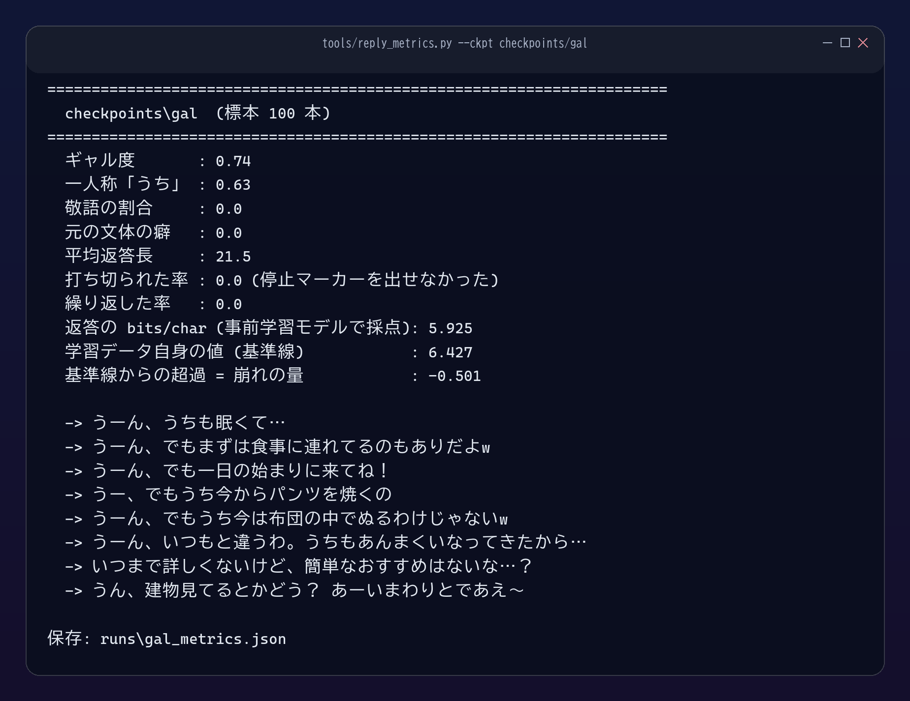

「あ、そっかりでしょw」のような文は、**文字の並びは自然なのに意味が通りません**。
文字種でも長さでも捕まりません。目で見れば分かりますが、20 条件を目で判定すると基準がぶれます。

そこで**追加学習する前のモデル（`checkpoints/final`）を物差しに使います**。
きれいな日本語で学習したモデルにとって崩れた文は「ありそうにない」ので、
1文字あたりのビット数が上がります。

ただしこれだけでは足りません。**ギャル語そのものも 2LM から見れば「ありそうにない」**ので、
口調を変えただけでビット数が上がります。だから**学習データのギャル語自身を同じモデルで
採点した値を基準線に置きます**（実測 **6.427 bits/char**）。ここを 0 として超過分だけを読みます。

| 指標 | 意味 | 読み方 |
|---|---|---|
| `excess_bits`（崩れの量） | 学習データ基準線からの超過 | 0 付近=崩れなし / 正=崩れ / 負=無難すぎ |
| `cut_rate`（打ち切り率） | 停止マーカーを出せず上限まで書いた割合 | 低いほど良い |
| `loop_rate`（繰り返し率） | 同じ言い回しから抜け出せなかった割合 | 低いほど良い |
| `gal_rate` | ギャル語の語彙・記号が出た割合 | 高いほど口調が付いている |
| `first_person_rate` | 一人称が「うち」だった割合 | 高いほど良い |
| `polite_rate` | 敬語が出た割合 | 0 が目標 |

**指標を1つにしてはいけません。取り逃す崩れがそれぞれ違います。**
lr 1e-2 の「、てが、」は7文字で終わるので**打ち切りも繰り返しも検出しません**
（崩れの量だけが 6.21 と反応）。逆に 0% 混合の 90 文字の暴走は、
崩れの量では -4.6（良好）と出ます。片方だけで判定すると、どちらかを見逃します。

そして**再現性の幅を先に測ります**。同じ設定を2回回した実測は、崩れていない側
（会話 2,000 / 100% / 24周 / lr 5e-4）でギャル度 0.87 と 0.87、崩れ +0.002 と
-0.015（差 0.017）。崩れている側（lr 2e-3）は同じ設定でもギャル度 0.74 と 0.63、
崩れ +1.68 と +1.24 まで動きます。
**0.05 未満の差は読まず、崩れた後の値は順位付けに使いません。**
設問 20 問 × シード5本 = 標本 100 本での値です（`--repeats 5`）。
設問が 20 問しかないので、1本ずつだと割合の刻みが 0.05 になってしまいます。

## 6. 崩れる境界を 20 条件で総当たりする

```powershell
python tools\boundary_sweep.py --counts 1000 1500 2000 3000 5000 --mixes 0 50 85 100
```

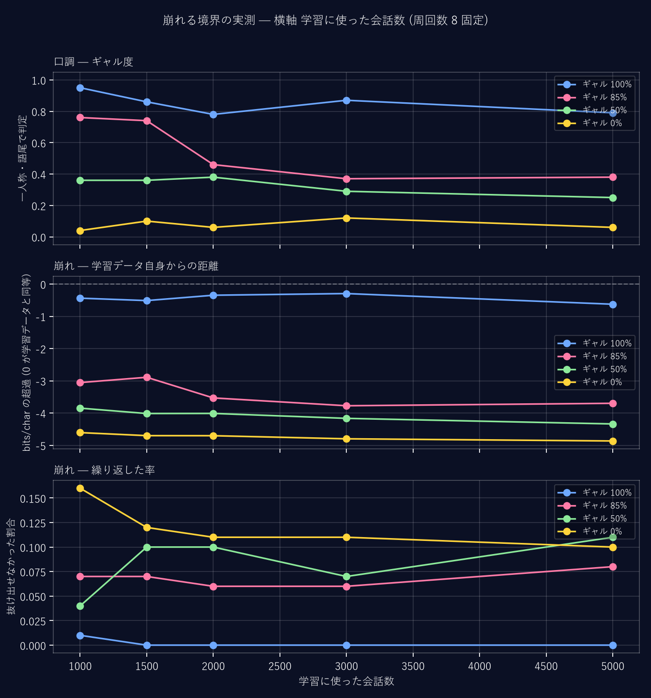

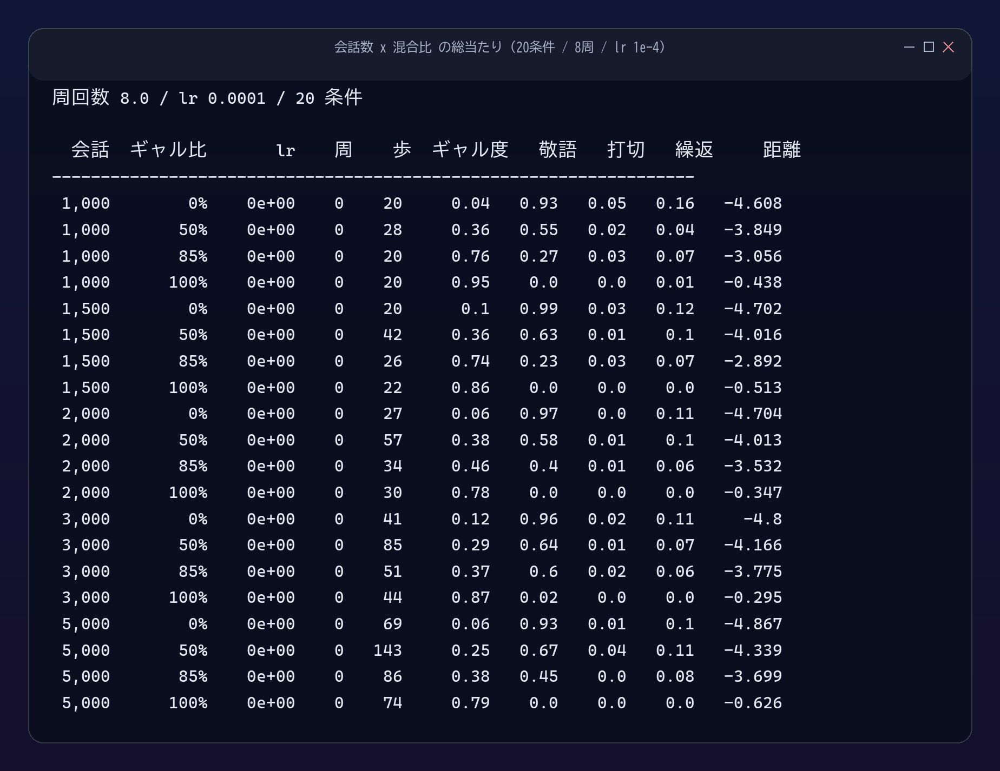

会話数 1,000 / 1,500 / 2,000 / 3,000 / 5,000 × 混合比 0 / 50 / 85 / 100% を総当たりしました。
**結果は予想と正反対でした。**

| 混合比 | ギャル度 | 打ち切り率 | 繰り返し率 |
|---|---|---|---|
| ギャル語 0% | 0.04〜0.12 | 0.00〜0.05 | **0.10〜0.16** |
| ギャル語 50% | 0.25〜0.38 | 0.01〜0.04 | 0.04〜0.11 |
| ギャル語 85% | 0.37〜0.76 | 0.00〜0.03 | 0.06〜0.08 |
| **ギャル語 100%** | **0.78〜0.95** | **0.00** | **0.00〜0.01** |

**いちばん崩れなかったのがギャル語 100% です。** 理由は返答の長さでした。
ギャル語の返答は 17〜20 文字で終わるので、**停止マーカーを出す練習**になります。
公開データ側の返答は 70〜98 文字あり、上限（120トークン）まで書き続けて
打ち切られたり、同じ言い回しに落ちたりします。
つまり「崩れ」の正体の一部は**話の内容ではなく、終わり方**でした。

そして**口調は混合比だけで決まり、会話数ではほとんど動きません**。
1,000 件でも 100% 混合ならギャル度 0.95 になり、5,000 件に増やすと 0.79 に下がります
（会話数が増えると同じ周回数でもステップ数が増え、混ぜた公開データを学ぶ量も増えるため）。

### 周回数を 20 倍にしても崩れない

```powershell
python tools\boundary_sweep.py --counts 2000 --mixes 100 --epochs 8 24 64 160
```

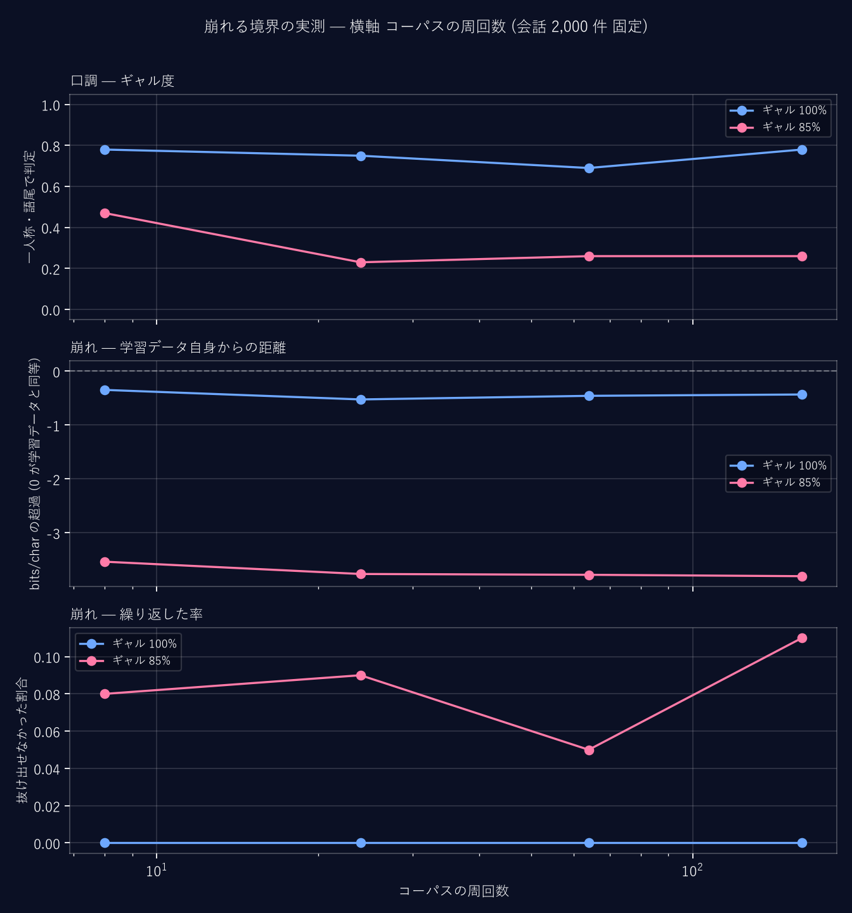

8 → 160 周（20 倍）まで振っても崩れませんでした。**この軸では境界に届きません。**

### 学習率を振ると、境界がはっきり出る

```powershell
python tools\boundary_sweep.py --counts 2000 --mixes 100 --epochs 24 --lr 1e-4 3e-4 5e-4 1e-3 3e-3 1e-2
```

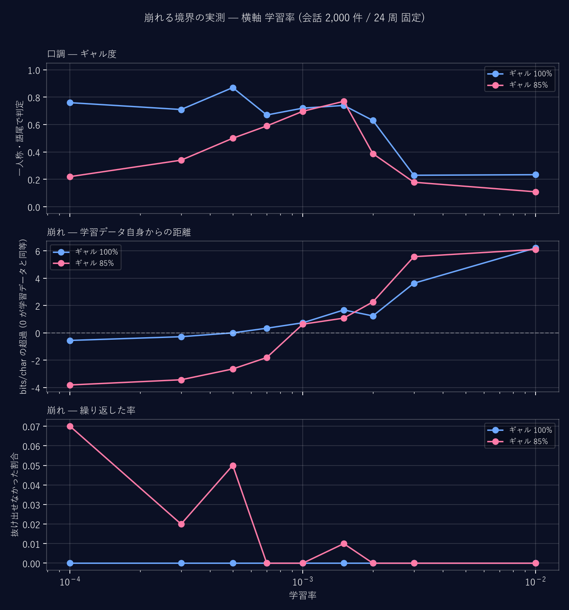

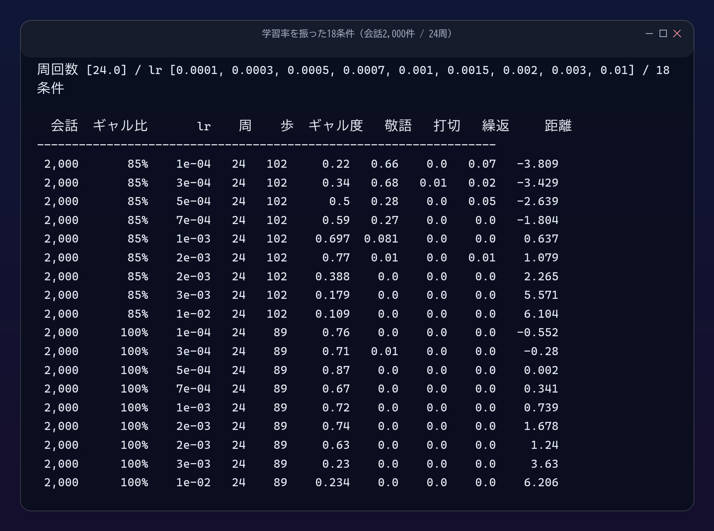

| 学習率 | ギャル度 | 崩れ | 返答例 |
|---|---|---|---|
| 1e-4 | 0.76 | -0.55 | うち、みんなで旅行費やしたの？ |
| 3e-4 | 0.71 | -0.28 | うち、お腹すいた… |
| **5e-4** | **0.87** | **+0.00** | うーん、うちも眠くて…でもないでしとこ探すぐばいいかw |
| 1e-3 | 0.72 | **+0.74** | めてあないら…うちもいいよね。 |
| 3e-3 | 0.23 | **+3.63** | 、てがないらのう |
| 1e-2 | 0.23 | **+6.21** | 、てが、 |

**崩れが 0 を横切る点と、ギャル度が最大になる点が一致します。**
「いちばん口調が付く設定」は「崩れ始める直前」です。ここが境界です。

考えてみれば当然で、口調を変えるとは**元の分布から離れること**だからです。
離れれば離れるほど口調は付き、離れすぎると日本語でなくなります。

### 境界は点ではなく面だった

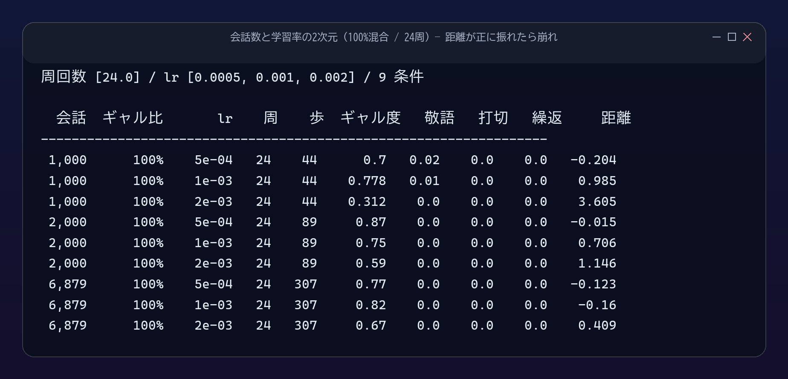

会話数と学習率の両方を振ると、**会話数を増やすと使える学習率の上限が上がる**ことが分かりました。

| 会話数 | lr 5e-4 | lr 1e-3 | lr 2e-3 |
|---|---|---|---|
| 1,000 | -0.20 | **+0.99 崩れ** | **+3.61 崩れ** |
| 2,000 | -0.02 | **+0.71 崩れ** | **+1.15 崩れ** |
| 6,879 | -0.12 | -0.16 | **+0.41 崩れ** |

Mac 版で「855件では崩れ、2,610件では崩れなかった」と書いたのは、
**学習率を固定したまま会話数を変えたから**そう見えたのだと、これで説明がつきました。
境界は1点ではなく、会話数と学習率が作る**面**です。

## 7. 払った代償: 汎用の予測能力は捨てることになる

```powershell
python eval\run.py --ckpt checkpoints\gal --tag gal
```

正直に書きます。最終モデルを前作と同じ4指標で測りました。

| | bits/char | 主題保持率 | ギャル度 |
|---|---|---|---|
| 2LM（追加学習前） | **2.586** | **0.733** | ほぼ 0 |
| ギャル 85% 混合 | 4.904 | **0.000** | 0.59 |
| ギャル 100% 混合 | 6.247 | **0.000** | 0.74 |

公開データに対する bits/char は 2.586 → 6.247 と **2.4 倍に悪化**します。
15% を公開データで埋めると 4.904 まで戻りますが、**主題保持率はどちらも 0.000** です。

**13.81M では「ギャル語で話す」と「話題を覚えている」を同時には持てません。**
これは失敗ではなく容量の話です。同じ重みに両方は入りません。今回は口調を取りました。

大きいモデルで LoRA が「口調だけ足す」ができるのは、
**元の重みを凍らせて別の場所に差分を置く**からです。
13.81M を丸ごと追加学習すると、元の能力の上に上書きすることになります。

## 8. 最終モデル

```powershell
# 6,879 会話（26万文字 / 20.8万トークン）を 24 周ぶん = 307 ステップ
python src\train.py --init-from checkpoints\final --corpus data\corpus_gal.txt `
    --cache-dir data\cache_gal --out checkpoints\gal --resume-dir checkpoints\gal_last `
    --log runs\gal_loss.csv --steps 307 --schedule-steps 307 --warmup 12 --lr 5e-4
```

`train.py` は周回数ではなくステップ数で止めます（`--steps`）。
`tools/boundary_sweep.py` は周回数から必要なステップ数を計算して渡しています。

| 項目 | 値 |
|---|---|
| 設定 | 6,879 会話 / 100% 混合 / 24 周 / lr 5e-4 |
| ステップ | **307**（5.0M トークン） |
| 学習時間 | **7.0 秒** / 1,032〜1,142k tok/s |
| 最終 val loss | 2.6977 |
| 専用VRAM ピーク | **1.88 GB** / 共有GPUメモリ増分 +0.01 GB |
| ギャル度 | **0.74** / 一人称「うち」0.63 / 敬語 **0.00** |
| 崩れ | **-0.50**（学習データより無難な側） |

### 追加学習の前と後（同じ問い・同じ種）

```powershell
python tools\compare_style.py
```

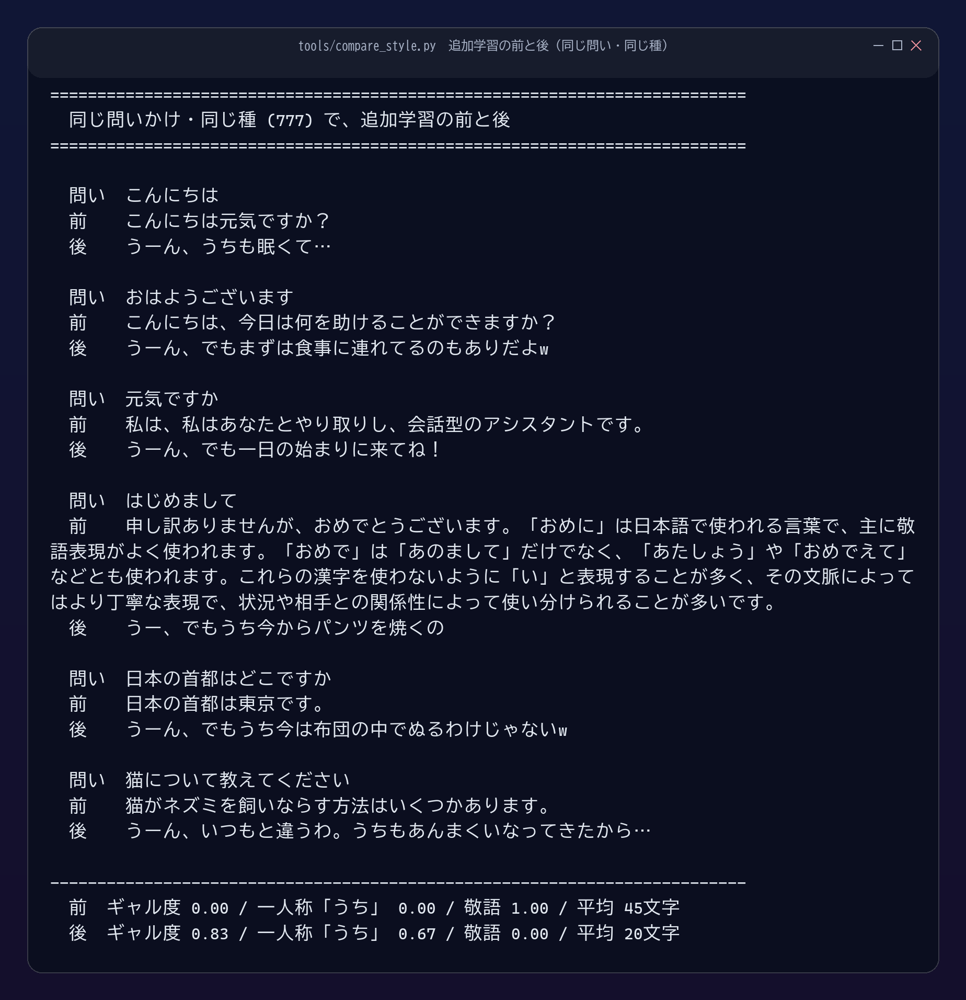

| 問いかけ | 前（2LM） | 後（GAL） |
|---|---|---|
| こんにちは | こんにちは元気ですか？ | うーん、うちも眠くて… |
| 元気ですか | 私は、私はあなたとやり取りし、会話型のアシスタントです。 | うーん、でも一日の始まりに来てね！ |
| 日本の首都はどこですか | 日本の首都は東京です。 | うーん、でもうち今は布団の中でぬるわけじゃないw |

この6問だけで見ると前は敬語 1.00 / ギャル度 0.00、後は敬語 0.00 / ギャル度 0.83 です
（標本 100 本で測った最終値は 0.74）。**首都は答えられなくなりました。** それが7節の代償です。

## 9. 会話する

### CLI

```powershell
python src\chat_cli.py --ckpt checkpoints\gal
```

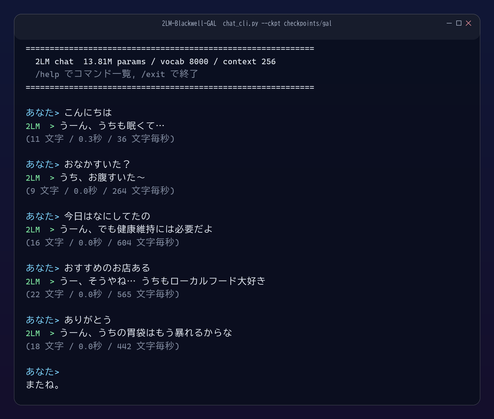

### Web GUI

```powershell
python server.py --ckpt checkpoints\gal --open
```


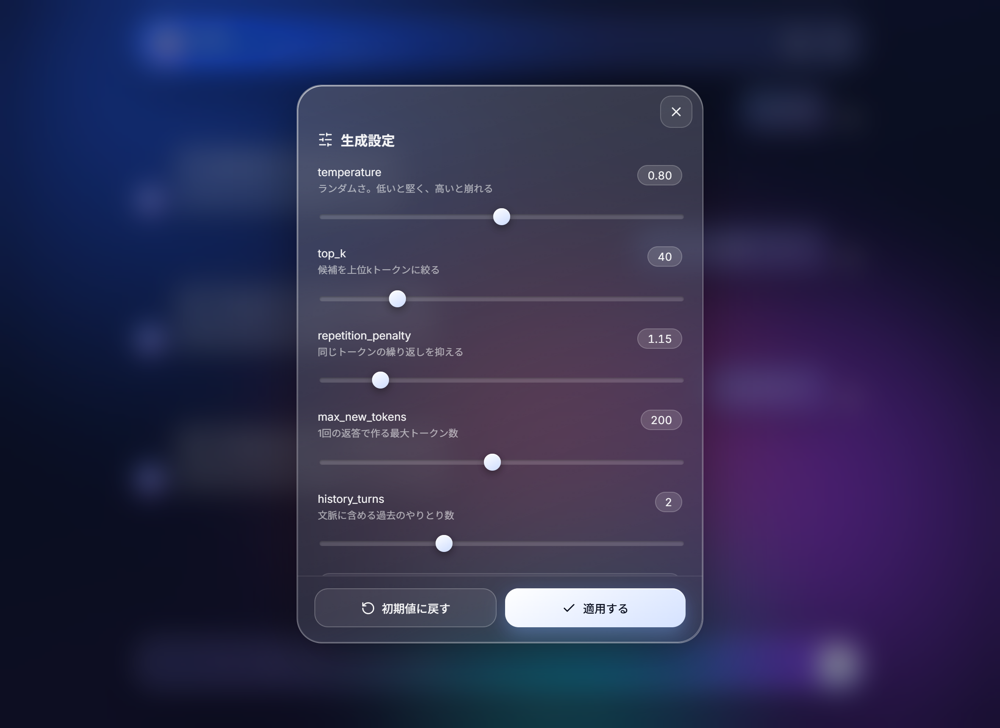

前作と同じ Liquid Glass 風の GUI です。サブワードでは1トークンが複数バイトに割れるため、
ストリーミングは累積トークン列をまとめて復号し、末尾が U+FFFD なら次を待ちます
（`src/generate.py` の `decode_incrementally`）。忘れると絵文字や一部の漢字が化けます。

## Windows 固有のバグ: 14回通って15回目で落ちる保存処理

20 条件を連続で回している途中、15 回目で落ちました。

```
PermissionError: [WinError 5] アクセスが拒否されました:
  'last_3000_85.tmp' -> 'last_3000_85'
```

保存は原子的に書いていました。一時ディレクトリに書き、既存を消して置き換えます。

```python
if path.exists():
    shutil.rmtree(path)
os.replace(tmp, path)   # ここで落ちる
```

`shutil.rmtree()` が返ってきても、Windows はディレクトリに「**削除待ち**」の印を
付けただけで、開いている handle が全部閉じるまで実体を残します。
その隙間に `os.replace()` を呼ぶと拒否されます。**posix では起きません。**
ウイルス対策や検索インデックスが後ろで開いていると起きやすく、
**一度動いたコードが後で落ちる**ので原因を疑いにくいバグです。

対策は削除を待たないことです（`runtime.replace_dir()`）。

1. 旧を別名（`.stale`）へ rename する。**rename は同期的に完了する**
2. 空いた本名へ新を rename する
3. `.stale` をあとで消す（消えるのを待つ必要はない）

1LM / 2LM 側も同じ実装に直しました。

## 仕組み

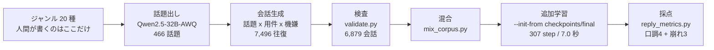

| ファイル | 役割 |
|---|---|
| [check_env.py](check_env.py) | 環境診断13項目。**最初に通す** |
| [runtime.py](runtime.py) | 共有GPUメモリの監視、`kv_report()`、`replace_dir()` |
| [tools/license_check.py](tools/license_check.py) | ライセンス本文から禁止条項を抽出（**着手前に通す**） |
| [tools/model_survey.py](tools/model_survey.py) | DL 前に KV キャッシュと重みの必要量を計算 |
| [tools/backend_ladder.py](tools/backend_ladder.py) | 量子化バックエンドを1段ずつ検証 |
| [tools/nan_hunt.py](tools/nan_hunt.py) | NaN が最初に出る層をフックで特定 |
| [data/gal/backends.py](data/gal/backends.py) | AWQ / GGUF / NF4 の共通インタフェースと壊れた AWQ の検出 |
| [data/gal/generate.py](data/gal/generate.py) | 4段のデータ生成（calibrate / topics / pairs / build） |
| [data/gal/validate.py](data/gal/validate.py) | 文字種・英単語・敬語・方言・長さ・重複・`<think>`・CRLF の検査 |
| [tools/mix_corpus.py](tools/mix_corpus.py) | 混合比を決めてコーパスを混ぜる |
| [tools/boundary_sweep.py](tools/boundary_sweep.py) | 会話数 × 混合比 × 周回数 × 学習率の総当たり |
| [tools/reply_metrics.py](tools/reply_metrics.py) | 口調4指標 + 崩れ3指標の採点 |
| [tools/show_boundary.py](tools/show_boundary.py) / [tools/plot_boundary.py](tools/plot_boundary.py) | 総当たり結果の表と図 |
| [tools/compare_style.py](tools/compare_style.py) | 同じ問い・同じ種で前後を比較 |
| [src/train.py](src/train.py) | 学習ループ。`--init-from` で追加学習 |
| [eval/run.py](eval/run.py) | 前作と同じ4指標で採点（代償の測定） |
| [server.py](server.py) / [web/](web/) | FastAPI + SSE / Liquid Glass 風 GUI |

## つまずきポイント

前作までのもの（cu130 / `torch.compile` の 260 文字 / 共有GPUメモリ / `\r` 混入 /
PowerShell の BOM）に加えて、今回だけのものを挙げます。

1. **AWQ が読めるのに壊れている** → `desc_act: true` かつ `meta.quantizer` が
   `gptqmodel` のものは AutoAWQ では読めません（例外は出ません）。
   `backends.check_awq_checkpoint()` で先に弾きます。
2. **AutoAWQ が import で落ちる** → `transformers` 4.55 で `PytorchGELUTanh` が
   `GELUTanh` に改名されました。`backends._patch_autoawq_imports()` で別名を張ります。
3. **共有GPUメモリを絶対値 0 で判定した** → WDDM は常に 0.08 GB ほどシステム側に置きます。
   **モデルを読み込んだ後からの増分**で見ます。
4. **`os.replace()` が 15 回目で落ちる** → `runtime.replace_dir()` を使います（上記）。
5. **指標1つで崩れを判定した** → 崩れの量・打ち切り率・繰り返し率は取り逃すものが違います。
6. **標本 20 本で条件を比べた** → 割合の刻みが 0.05 になります。`--repeats 5` でシードを振ります。
7. **`excess_bits` を混合比をまたいで比べた** → 水準そのものが変わります
   （0% 混合では -4.7）。**同じ混合比の中でだけ**比べます。

## 同梱物について

```
checkpoints/final/          # 追加学習の出発点（2LM-Blackwell で学習した重み）
checkpoints/gal/            # ギャル語の最終モデル（約56MB）
data/raw/gal_line.jsonl     # 生成した 6,879 会話（検査済み）
data/tokenizer/             # SentencePiece 語彙 8,000（再学習しないこと）
runs/*.json                 # 記事に載せた数値の出典
```

**データ生成（36.7 分）と学習（7 秒）を飛ばして試せます。**
語彙を作り直すとトークンIDの対応が変わり、同梱の重みが読めなくなります。

## ライセンス / クレジット

**コード**は MIT License です（[LICENSE](LICENSE)）。
Apple Silicon / MLX 版 [2LM-MLX-GAL](https://github.com/hiroki-abe-58/2LM-MLX-GAL) の移植で、
原典も同じ作者・同じ MIT License です。

**同梱のデータセット**（`data/raw/gal_line.jsonl`）は、Apache-2.0 の
Qwen2.5-32B-Instruct-AWQ で生成した**完全な合成データ**です。実在の人物・団体とは関係ありません。
Apache-2.0 は出力の利用に条件を付けていないので、データセットとここから学習した重みは
配布・商用利用できます。詳細は [NOTICE](NOTICE) と
[licenses/Apache-2.0.txt](licenses/Apache-2.0.txt) にあります。

同梱のデータセットは、特定の話し方をする人々を代表するものではなく、揶揄する意図もありません。
**口調がデータで決まることを示す教材**として作りました。

生成される文章は、コーパスの統計から次の1トークンを予測し続けた結果にすぎません。
事実性は一切保証されません（**首都すら答えられません**）。
出力を公開の場に掲載する場合は、機械生成物である旨を明記してください。

## 3部作

| | リポジトリ | 主題 |
|---|---|---|
| 第1部 | [1LM-Blackwell](https://github.com/hiroki-abe-58/1LM-Blackwell) | 文字レベル 11.53M。移植の同値確認と Windows の落とし穴 |
| 第2部 | [2LM-Blackwell](https://github.com/hiroki-abe-58/2LM-Blackwell) | サブワード 13.81M。ぎりぎり話が通じるところまで |
| **第3部** | **2LM-Blackwell-GAL** | **データを自分で作る。崩れる境界の実測** |

3部作を通じて、制約は一度も VRAM ではありませんでした。32 GB のうち使ったのは 1.9 GB です。
足りないのは常にデータと、測る道具でした。
